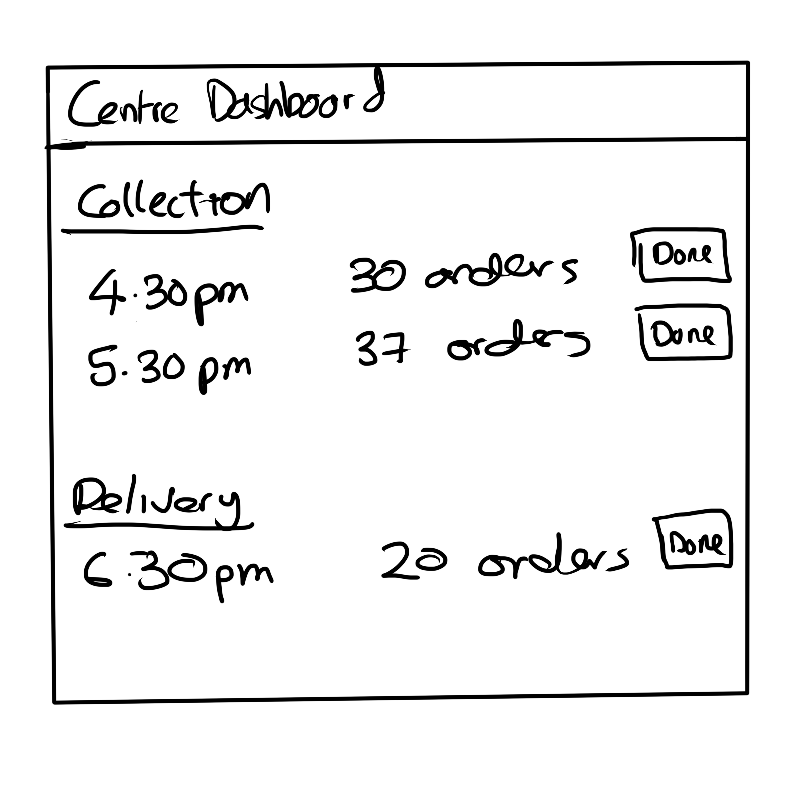

# Collection centre API Documentation

The Collection centre API documentation allows you to manage a collection centre's dashboard.

## Wireframe

## GET Collection centre profile

TBC

## GET Today's orders

TBC

## GET Order Batch

TBC

## UPDATE Order batch status

TBC

## UPDATE max meal capacity

TBC

## UPDATE Collection centre profile

TBC
